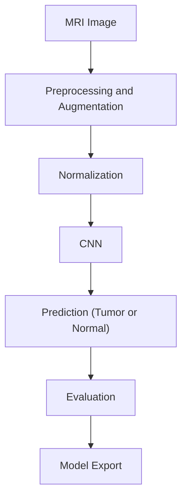

# Brain Tumor Detection

Artificial Intelligence project for brain tumor detection.  
This project provides an automated solution to analyze brain MRI images and predict the presence or absence of tumors.  
It uses image processing techniques, convolutional neural networks (CNNs), and supervised optimization.

---

## Objectives

- Use MRI datasets to train a classification model.
- Develop a pipeline for image preprocessing, augmentation, and normalization.
- Deliver a robust model to assist doctors in rapid tumor screening.

---

## Modeling Approach

The pipeline includes four main steps:

1. **Preprocessing and Augmentation**
   - Resize and normalize images.
   - Apply realistic augmentations (rotations, zooms, flips).

2. **Model Construction**
   - CNN architecture with convolutional, pooling, and dropout layers.
   - Option for fine-tuning using pre-trained models (VGG16, ResNet50).

3. **Training and Cross-Validation**
   - Split the dataset into training, validation, and test sets.
   - Use callbacks (EarlyStopping, ModelCheckpoint) to save the best model.
   - Track metrics: accuracy, recall, F1-score.

4. **Evaluation and Export**
   - Visualize learning curves (accuracy and loss).
   - Confusion matrix and classification report.
   - Export the final model in `.keras` or `SavedModel` format.

---

## Technologies Used

- Python 3.8+
- Jupyter Notebook
- Libraries: numpy, pandas, matplotlib, seaborn, tensorflow, keras, opencv-python, PIL, scikit-learn

---

## Medical Context

Brain tumors are a major challenge in neuro-oncology.  
This project aims to develop an automated assistance tool to:
- reduce image reading time,
- minimize human errors,
- facilitate early detection.

---

## Results Achieved

- High accuracy on the test set
- Stable learning curves
- Improved generalization thanks to data augmentation and transfer learning

---

## Global Pipeline


---
 
## Exécution

```bash
# Clone the repository
git clone https://github.com/votre_nom/Brain_Tumor_Detector.git

# Navigate to the directory
cd Brain_Tumor_Detector

# Install dependencies
pip install -r requirements.txt

# Launch the main notebook
jupyter notebook notebooks/brain_tumor_detection_final.ipynb

```

## Authors

| Name              | Links |
|-------------------|----------|
| **Akram Halimi**     | [](https://www.linkedin.com/in/akram-halimi-010217321/) [](https://github.com/A-Jassim) |

---

## License

Distributed under the MIT license. See the [LICENSE](LICENSE) file for more information.
